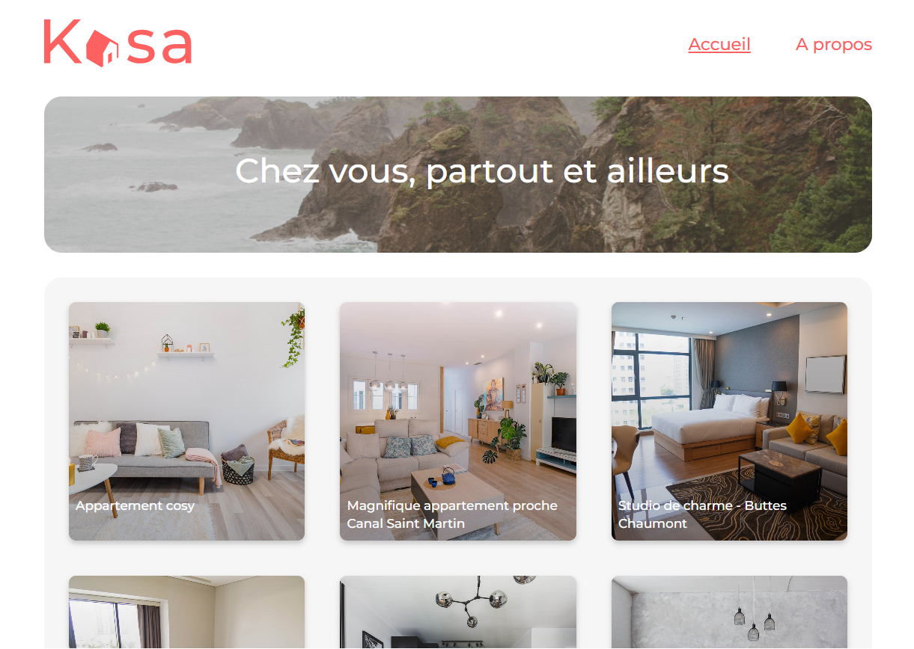

# 

<!-- # Découvrez ce projet en live juste ici : [kasa]() -->

# Objectif
Démarrer le projet React et développer l’ensemble de l’application, les composants React, les routes React Router, en suivant les maquettes Figma (responsives !) 

# Back-end / data
La personne responsable du back-end n'a pas encore été recrutée. En attendant, il est nécessaire d'utiliser un [fichier json](https://s3-eu-west-1.amazonaws.com/course.oc-static.com/projects/Front-End+V2/P9+React+1/logements.json) pour pouvoir construire le Front qui correspond. pour avancer sur la construction du front-end correspondant. 

# Design et maquettes
Pour le design d'interface les maquettes du site sont sur [Figma](https://www.figma.com/design/bAnXDNqRKCRRP8mY2gcb5p/ARCHIVE-UI-Design-Kasa-FR?node-id=3-0) .

# Contraintes techniques 
Les coding guidelines de Kasa sont [ici](https://course.oc-static.com/projects/Front-End+V2/P9+React+1/Coding+guidelines+Kasa+FR.pdf). 

# Contraintes fonctionnelles
### Quelques précisions sur les fonctionnalités du site :

* Pour le défilement des photos dans la galerie (composant Gallery) :
  - Si l'utilisateur se trouve à la première image et qu'il clique sur "Image précédente", la galerie affiche la dernière image. 
  - Inversement, quand l'image affichée est la dernière de la galerie, si l'utilisateur clique sur "Image suivante", la galerie affiche la première image. 
  - S'il n'y a qu'une seule image, les boutons "Suivant" et "Précédent" n'apparaissent pas.

* La galerie doit toujours rester de la même hauteur, celle indiquée sur la maquette Figma. Les images seront donc coupées et centrées dans le cadre de l’image.

* Collapse : Par défaut, les Collapses sont fermés à l'initialisation de la page. 
* Si le Collapse est ouvert, le clic de l'utilisateur permet de le fermer.
Inversement, si le Collapse est fermé, un clic permet de l'ouvrir.

# Les technologies utilisées

